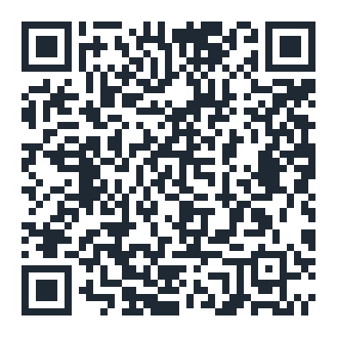
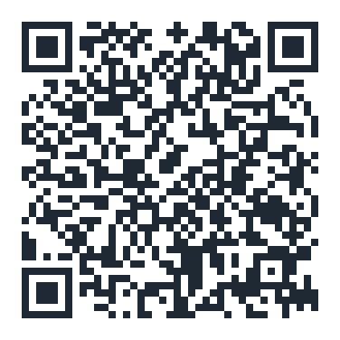
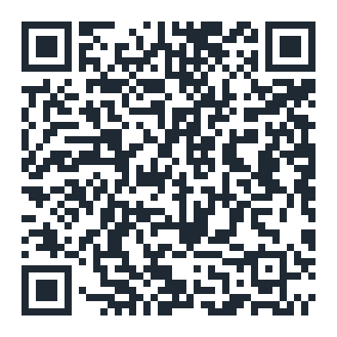
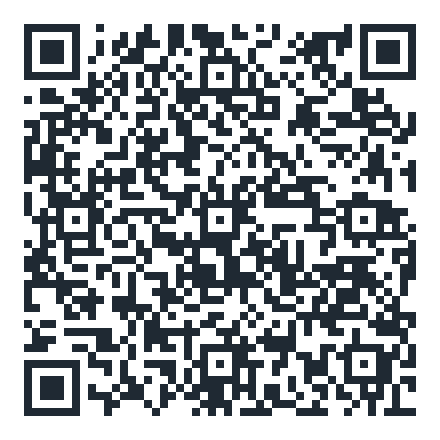
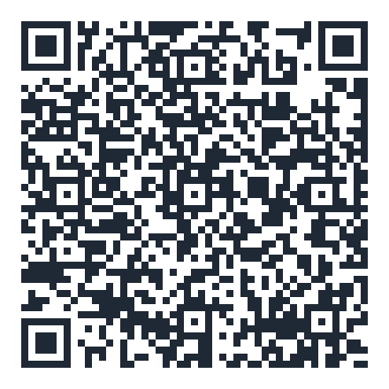
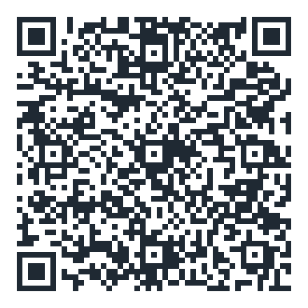

# 動画解析トラッカー (Video Motion Tracker)

動画から物体の運動（位置・速度・加速度）を測る、**ブラウザだけで動く**運動解析ツールです。
高校物理の授業で、生徒一人ひとりが自分の端末（iPad / スマートフォン / PC）で使うことを想定しています。

**インストール不要・アカウント不要・ビルド不要。動画は端末内で処理され、どこにも送信されません。**

- **アプリ**: <https://phys-ken.github.io/video-motion-tracker/>
- **実験手順書（生徒向け）**: <https://phys-ken.github.io/video-motion-tracker/guide/>
  — 自由落下 / 鉛直投げ上げ / 水平投射 / 斜方投射

## 授業で配る（QRコード）

黒板に投影するか、プリントに貼って配ってください。生徒は読み取るだけで始められます。

| アプリ本体 | **使い方（操作）** | 手順書: 自由落下 | 手順書: 鉛直投げ上げ | 手順書: 水平投射 | 手順書: 斜方投射 |
|:---:|:---:|:---:|:---:|:---:|:---:|
|  |  |  |  |  |  |
| [開く](https://phys-ken.github.io/video-motion-tracker/) | [開く](https://phys-ken.github.io/video-motion-tracker/manual/) | [開く](https://phys-ken.github.io/video-motion-tracker/guide/) | [開く](https://phys-ken.github.io/video-motion-tracker/guide/vertical_throw.html) | [開く](https://phys-ken.github.io/video-motion-tracker/guide/projectile.html) | [開く](https://phys-ken.github.io/video-motion-tracker/guide/oblique.html) |

**使い方**は画面写真つきの1ページで、アプリの操作だけを7ステップで説明します。
押す場所は画像の中に**赤枠**で示してあります。配布用の
[PDF](https://phys-ken.github.io/video-motion-tracker/manual/manual.pdf)は**A4・1枚**で、
リポジトリにも置いてあります（`manual/manual.pdf`）。
**手順書**は実験そのもの（何を用意し、どう撮るか）の説明です。

誤り訂正レベル H（30%）で作ってあるので、印刷が多少かすれても読み取れます。
URL を変えたときは `tools/gen_assets.py` で再生成してください。

## できること

- **中央十字＋「確定」方式の点打ち** — 指で対象を隠さず正確に打てます。確定で自動コマ送り。
- **正確な時刻 t** — 動画コンテナから各コマの実時刻を読み取るため、可変フレームレートや
  複製フレームがあってもずれません。スロー撮影の補正にも対応。
- **迷わないコマ送り** — 送るとページがめくれるアニメーション、コマカウンタ常設、
  ±10のパラパラ表示、長押しで連続送り。
- **打点マップ** — どのコマに座標が決まったかを一覧表示。タップでそのコマへ移動でき、
  打ち漏らしをすぐ直せます。
- **グラフ** — 位置・速度・加速度。運動の種類に応じたプリセット付き。
  **拡大して範囲をドラッグ選択すると、その区間の回帰直線の傾き**（v–t なら平均加速度、
  つまり重力加速度の測定値）が読めます。
- **出力** — **提出用PNG**（ストロボ＋グラフ・照合コード入り）。数表の TSV / xlsx は画面最下部。
- **教室向けの作り** — 白ベースの明るい画面、外部CDNへの接続なし、色覚多様性に配慮した配色。

## 使い方

- **生徒**: 上のURLをブラウザで開くだけです。
- **先生**: 授業で配る場合は、アプリのURLと必要な回の手順書URLを渡してください
  （手順書はアプリからはリンクしていないので、使う回だけ配れます。印刷にも対応）。
- **ローカルで動かす**:

  ```bash
  python3 serve.py     # → http://localhost:8000
  ```

  同一LANの iPad からは `http://<PCのIPアドレス>:8000` で開けます。

詳しい操作は **[MANUAL.md](MANUAL.md)**、設計の考え方は **[DESIGN.md](DESIGN.md)** にあります。

## リポジトリ構成

| パス | 役割 |
|---|---|
| `index.html` / `app.js` / `styles.css` | アプリ本体（この3つで完結。フレームワーク不使用） |
| `guide/` | 生徒向け実験手順書サイト（4種の落体運動・相互ナビ付き） |
| `samples/` | 真値が既知の合成サンプル動画（`tools/gen_samples.py` で再生成可能） |
| `assets/` | アプリのアイコン（`tools/gen_assets.py` で生成） |
| `docs/qr/` | 配布用QRコード（同上） |
| `tools/` | サンプル動画・アイコン・QRのジェネレータ |
| `serve.py` | ローカル開発サーバ（キャッシュ無効・LAN公開） |
| `test_logic.js` / `tests/` / `test.html` | テスト一式 |
| `manual/` | 生徒向けの使い方（画面写真つき）と配布用PDF。`npm run shots` で再生成 |
| `teacher/` | 提出画像の照合ページ（教員用・アプリからのリンクなし） |
| `docs/CLASSROOM.md` | 授業当日の手引き（教員用） |
| `vendor/` | 同梱ライブラリ（[THIRD_PARTY_NOTICES.md](THIRD_PARTY_NOTICES.md)） |

## テスト

追加インストールは不要です（Node 標準機能と、インストール済みの Chrome のみを使います）。

```bash
npm test              # ロジック単体テスト（数値微分・時刻表・座標軸・スロー補正 ほか）
npm run test:e2e      # 実Chromeを DevTools Protocol で駆動するE2E（動画を実デコード）
npm run test:precision # 真値既知の動画から g を測り 9.8±5% と v-t の直線性を検証
npm run test:views    # PC/タブレット横/タブレット縦/スマホの4画面を通しで検証
npm run test:ipad     # iPadのUA・タッチ・回転で通しで検証（縦動画・ピンチ・保存）
npm run test:teacher  # 教員用の照合ページが重複を見つけられるかを検証
npm run test:trim     # 「使う範囲を決める」画面（表示の一貫性・帯・44px・コマ落ち）
npm run test:manual   # 使い方ページ（画像の欠け・alt・横スクロール・印刷）
npm run shots         # 使い方ページの画面写真と配布用PDFを作り直す（UIを変えたら実行）
npm run test:all      # 上記すべて
```

`test:views` は、起動パネル → スケール設定 → 追跡 → グラフ → 提出用レポートまでを
4つの画面幅で実際に走らせ、**横スクロール・パネルの重なり・画面外へのはみ出し**を
機械的に検出します（`VIEWS_SHOTS=/path/to/dir` を付けるとスクリーンショットも保存）。

`test.html` は `python3 serve.py` 後にブラウザ（iPad/Safari 可）で開く目視用ハーネスです。

## 依存関係

npm パッケージへの依存はありません。実行時に必要なライブラリは `vendor/` に同梱し、
**外部CDNには一切接続しません**（学校のネットワークフィルタ下でも動くようにするため）。

| ライブラリ | 用途 | ライセンス |
|---|---|---|
| [SheetJS](https://sheetjs.com/) (`xlsx`) | xlsx 書き出し | Apache-2.0 |
| [MP4Box.js](https://github.com/gpac/mp4box.js) | 動画コンテナ解析（各コマの実時刻取得） | BSD-3-Clause |
| [Material Icons](https://github.com/google/material-design-icons) | UIアイコン | Apache-2.0 |

詳細は [THIRD_PARTY_NOTICES.md](THIRD_PARTY_NOTICES.md) を参照してください。
本文の書体は端末内蔵のものを使うため、Webフォントの読み込みもありません。

## ライセンス

本リポジトリのコードとドキュメントは **MIT License** です（[LICENSE](LICENSE)）。
© 2026 phys-ken。授業でも改変版の配布でも自由にお使いください。
`vendor/` の同梱ライブラリは各原作者のライセンスに従います。

## クレジット

本アプリは独立実装ですが、設計・概念の面で次の先行ソフトウェアから着想を得ました
（**コードの流用はありません**）。

- **IPhO2023 記念協会「Physics Exam Lab — 動画解析アプリ」**（作: ODA Tomohiro）
  <https://apps.ipho2023-commemorative-association.jp/>
- **Open Source Physics「Tracker」/「Tracker Online」**（作: Douglas Brown, OSP / AAPT-ComPADRE）
  <https://opensourcephysics.github.io/tracker-website/>
